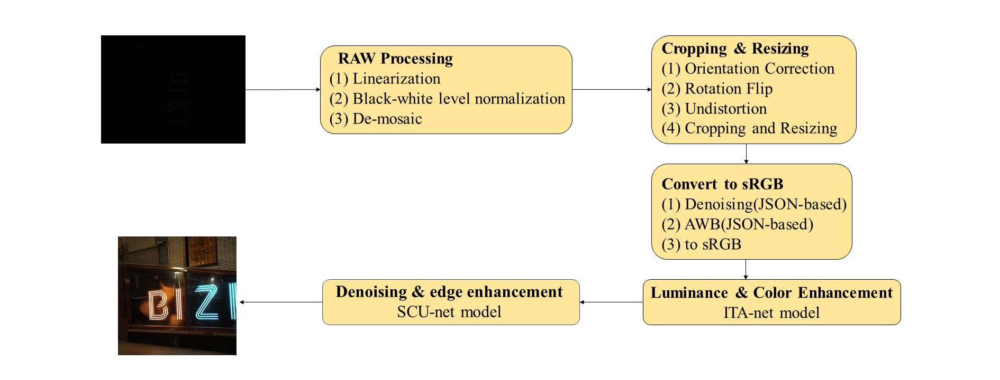
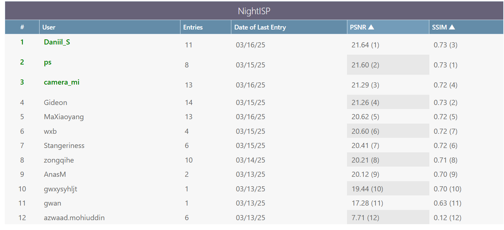

The resolution of psykhexx team in NTIRE 2025 [Night Photography Rendering Challenge](https://nightimaging.org/)
==============================

  This repository contains the source code of solution from the psykhexx team in NTIRE 2025 Night Photography Rendering Challenge
Our pipeline consists of five main steps, each of which optimizes a different aspect of
the image. First, we performed a series of corrections and pre-processing on the original input image to
obtain a cropped sRGB image. Then, we use two independent neural networks, IAT[paper](https://arxiv.org/abs/2205.14871) and SCUNet[paper](https://arxiv.org/pdf/2203.13278),
to render the image with an end-to-end feature fusion strategy, borrowing from the image processing
methods of professional photographers. Specifically, IAT is responsible for adjusting contrast, brightness,
hue, and saturation to enhance the dynamic range and color performance of the image; while SCUNet
combines noise reduction and edge enhancement to further optimize image quality and visual perception.


### The purpose of participating in the competition is purely for scientific research training.

We won the fifth place in the fourth phase of the NTIRE 2025 Night Photography Rendering Challenge (as of 2025/3/16)



## Configuration
```
pip install -r requirements.txt
```

## test
Put your raw data and camera configuration file .json into the ./data/test/ folder and execute:
```
python pipeline.py
```

## Acknowledgment  
The code of ITA model is from  [Illumination-Adaptive-Transformer](https://github.com/cuiziteng/Illumination-Adaptive-Transformer)

The code of SCUNet model is from [SCUNet](https://github.com/cszn/SCUNet)

The code of raw pipline is from [nightimaging25](https://github.com/createcolor/nightimaging25?tab=readme-ov-file)